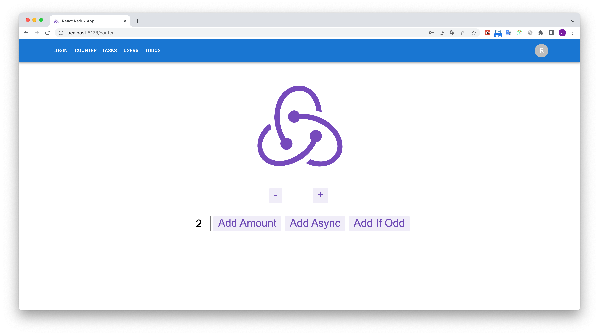
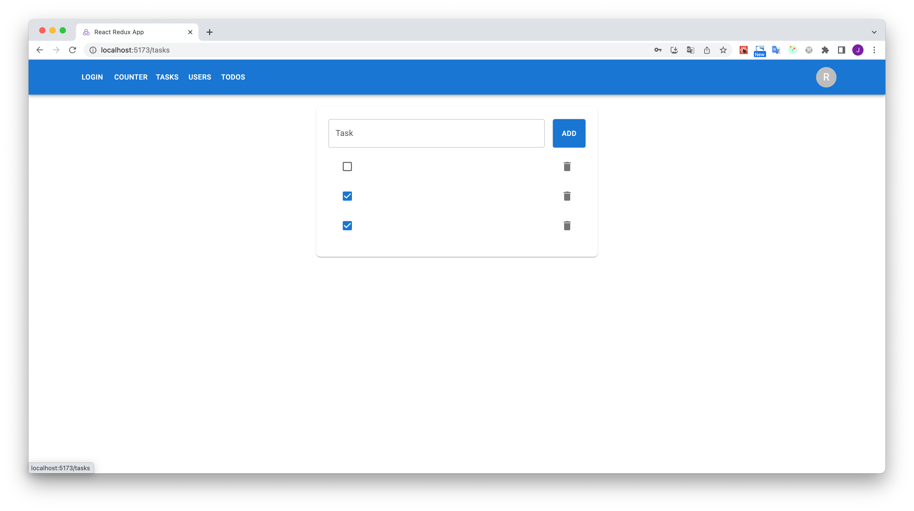
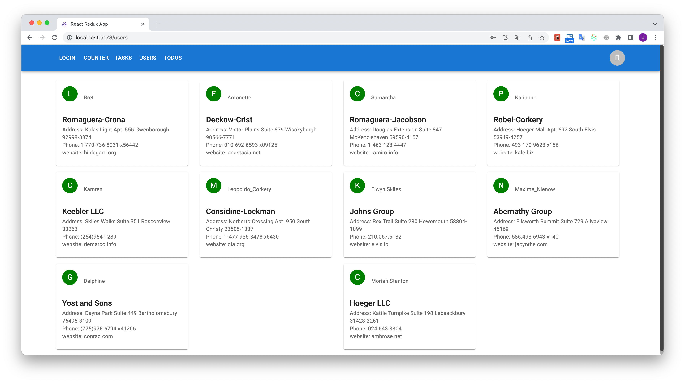
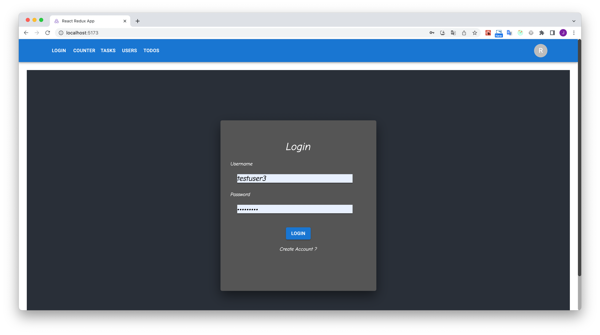
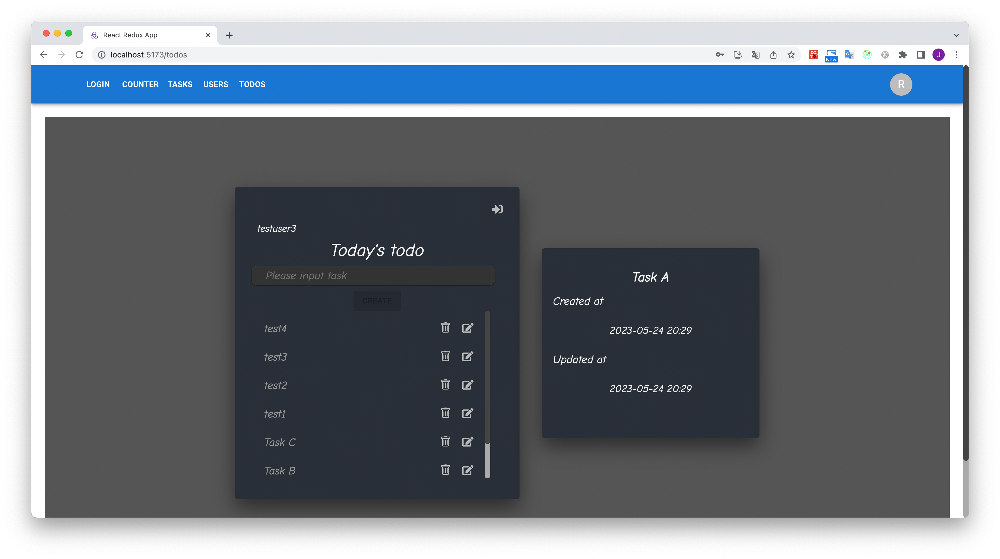

# [Redux編] Redux Tool KitとReact HooksによるモダンReact フロントエンド開発

https://www.udemy.com/share/103iJY3@s1lproZCQibfyj9RHvl2CECHzdvsXNkyS6BTchelhQJe_2K8QTRP1vZYGBxWsgYVvA==/

Kazu T+さんの講座でRTKとDjango REST FrameworkでTodoアプリを作ります。
講座のサンプルは3年前に作られたので、相当バージョンが古いしJavaScriptで作られています。
このサンプルはライブラリのバージョンを全部最新バージョン（2023/06/01基準）に上げました。
またTypeScriptで作って、いろんなところをリファクタリングしました。
講座では二つのプロジェクトで行っていますが、一つにまとめてReact Routerで分岐する形を取りました。
レイアウトを含めてUIはMUIを使っています。

このリポジトリはフロントエンド側です。
バックエンドは[ここ](https://github.com/aJonghunPark/django_todoapi)をご参照ください。

## nodeの環境構築

私はnvmでnodeのバージョン管理を行っていますが、nodenvなど他のものを使っても構いません。

```sh
brew install nvm
```

nvmで最新バージョンのnodeをインストールします。
nvm ls-remote --ltsでインストールできるnodeのリストが表示されます。
私は現時点の最新である18.15.0をインストールしました。

```sh
# インストールできるnodeのリストを確認
nvm ls-remote --lts

# nodeをインストールする。
nvm install 18.15.0

# インストールしたnodeのバージョンを確認
nvm ls

# インストールしたnodeのバージョンを指定
nvm use 18.15.0

# インストールしたnodeのバージョンをデフォルトで設定
nvm alias default v18.15.0
```

## プロジェクトの生成

```sh
create-react-app react-query-todos --template redux-typescript
```

Reactのプロジェクトの場合は色々と下準備が必要です。
[この文書](https://github.com/aJonghunPark/rtk-saga-crud/blob/main/doc/02.install.md)をご参照ください。
上記の文書からRedux-Sagaはインストールする必要がありません。

※ プロジェクトの生成はcreate-react-appでしたが、途中でviteでマイグレーションしました。
viteへのマイグレーション手順は[ここ]()をご参照ください。

## Built With

* [TypeScript](https://github.com/microsoft/TypeScript)
* [React](https://github.com/facebook/react)
* [Router Dom](https://github.com/remix-run/react-router)
* [Redux Toolkit](https://github.com/reduxjs/redux-toolkit)
* [material ui](https://github.com/mui/material-ui)
* [Vite](https://github.com/vitejs/vite)
* [Jest](https://github.com/jestjs/jest)
* [esbuild-jest](https://github.com/aelbore/esbuild-jest)

## Getting Started

下準備が終わったら、yarn startでクライアントを立ち上げます。
apiサーバーのURLなどは環境毎に異なるため、gitではなく各サーバーの環境変数で管理するのが一般的です。
yarn startする前に.env.localファイルを作成します。

```sh
vim .env.local

REACT_APP_REST_URL=http://127.0.0.1:8000/

:wq

yarn start
```

この場合、バックエンド側のサーバーも立ち上げないといけません。
バックエンド側のサーバーは[ここ](https://github.com/aJonghunPark/django_todoapi)をご確認ください。

* counterのサンプル画面



* tasksのサンプル画面



* usersのサンプル画面



* loginのサンプル画面



* Todoアプリのサンプル画面


